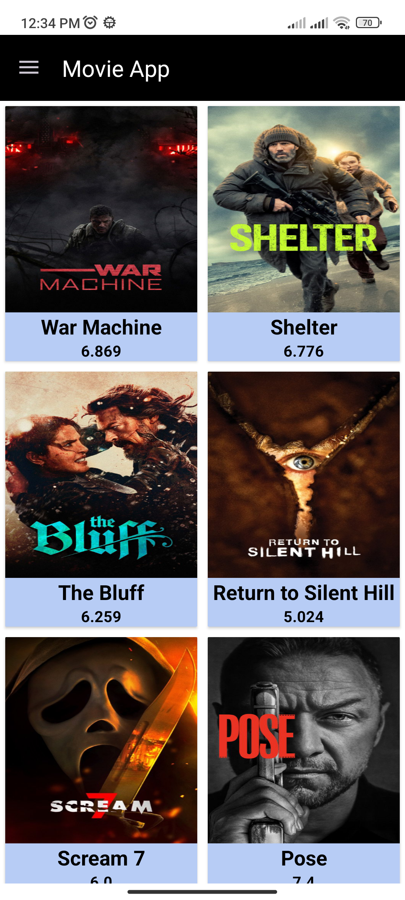
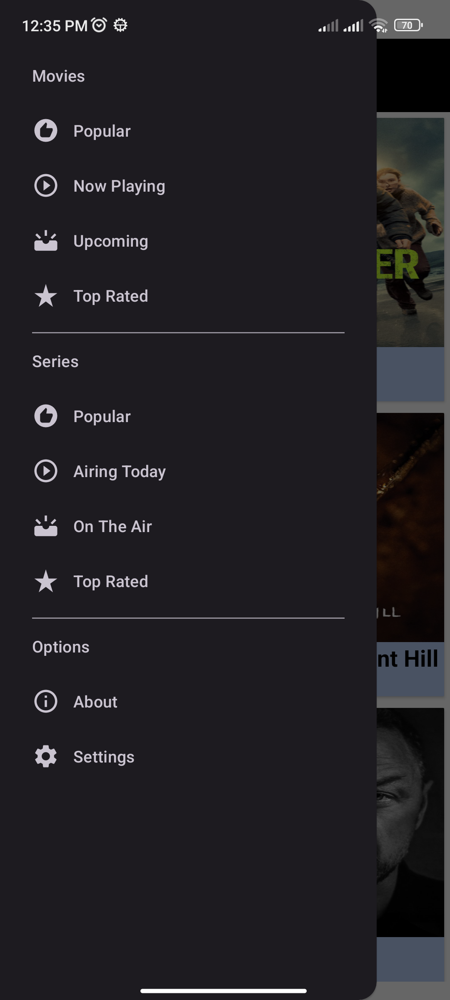
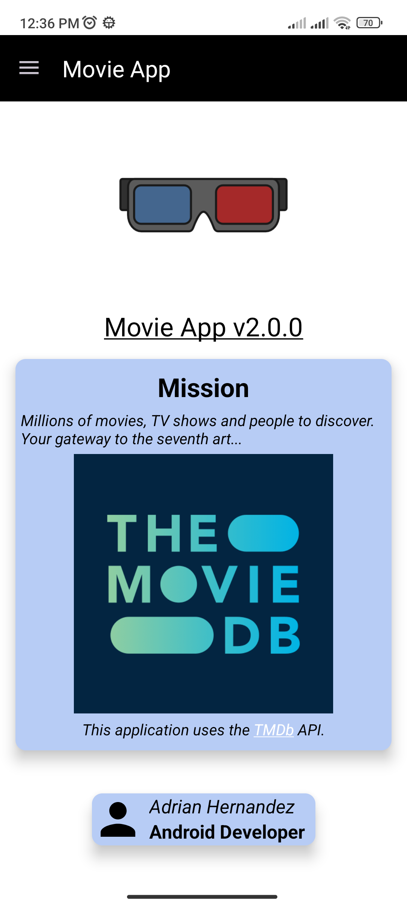

# Movie App

## 🎯 Objetivo del proyecto
- Refactorizacíon de codigo en Kotlin de la version previa (The Movie App with Java).
- Mejorar la interfaz.
- Ve las reseñas de las peliculas y series del momento usando los servicios de TheMovieDatabase.
- Implementación de LiveData y DataBinding.
- Tenga Clean Architecture.
- MVVM.
- Sea fácil de mantener y extender.

## 🚀 Características
- Interfaz de usuario limpia e intuitiva.
- API´s Rest.
- Sigue las mejores prácticas de Android.

## 🛠️ Tecnología utilizada
- API´s Rests
- LiveData y DataBinding
- Arquitectura MVVM
- Glide.
- Lottie. 

## 📌 Mejoras futuras
- Agregar vista de cada de película/serie.
- Agregar SearchView para busqueda de películas/series.

## 📱 Screenshots

  
  
  

## 🎥 Demo

  

## 👤 Autor
Adrián Hernández López / 
Desarrollador Android
